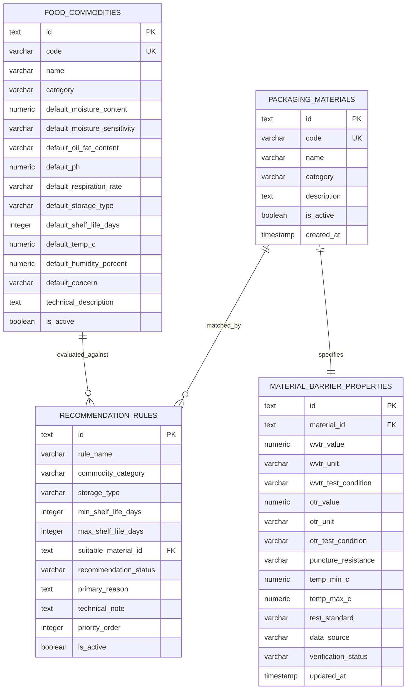

# FoodPack AI — Phase 2 Pre-Implementation Inspection Report

**Project Title:** FoodPack AI — AI-Based Intelligent Food Packaging Material Recommendation System for Food Commodities  
**Problem Statement:** Smart India Hackathon (SIH PS 26236)  
**Phase:** Phase 2 Pre-Implementation Inspection & Architecture Plan  
**Status:** Inspection Completed — No database or UI code modified  

---

## Executive Summary

This document presents a comprehensive technical inspection of the existing **FoodPack AI** Phase 1 application prior to initiating Phase 2 backend and database integration. The inspection audits the current frontend architecture, existing data models, mock recommendation logic, Supabase connection readiness, and establishes a practical, minimal database schema and transparent rule-based screening engine for Phase 2.

---

## 1. Current Frontend Architecture & Stack

### 1.1 Technology Stack & Versions
- **Frontend Framework:** React 19 (`react` `^19.2.8`, `react-dom` `^19.2.8`)
- **Build Tooling & Dev Server:** Vite 8.3.0 (`vite` `^8.3.0`, `@vitejs/plugin-react` `^6.1.1`)
- **Language & Compiler:** TypeScript 6.0.2 (`typescript` `~6.0.2`, target `ES2022`, `verbatimModuleSyntax: true`)
- **Linter & Code Quality:** Oxlint (`oxlint` `^1.81.0`) configured via `.oxlintrc.json`
- **Styling System:** Vanilla CSS with institutional government design tokens (Navy `#062B52`, White `#FFFFFF`, Neutral Grey `#F3F3F3`, Border `#D0D0D0`) in `src/index.css`

### 1.2 Project File Structure
```
c:/Users/sanika/OneDrive/Desktop/sage/
├── public/
├── src/
│   ├── assets/
│   ├── components/
│   │   ├── Button.tsx           # Institutional button (primary navy #062B52, secondary white)
│   │   ├── InputField.tsx       # Standard 42px rectangular input with unit suffix & inline validation
│   │   ├── Navbar.tsx           # Two-level government navigation bar (Navy top bar + white link bar)
│   │   └── SelectField.tsx       # Standard rectangular select dropdown with custom indicator
│   ├── data/
│   │   ├── commodities.ts       # 13 illustrative commodity presets and baseline parameters
│   │   └── mockMaterials.ts     # 8 packaging materials & heuristic screening logic
│   ├── pages/
│   │   ├── FoodDetails.tsx       # 12-parameter input form (Commodity, Storage, Transit, Concerns)
│   │   ├── Home.tsx              # Minimal official landing page with "Start Recommendation" CTA
│   │   └── Results.tsx           # Packaging recommendations rendered in visible 1px bordered boxes
│   ├── types/
│   │   └── recommendation.ts    # TypeScript definitions for forms, commodities, and recommendations
│   ├── App.css                  # Cleared template styles (unused)
│   ├── App.tsx                  # Root state management & client-side page routing
│   ├── index.css                # Official Government design tokens and typography rules
│   └── main.tsx                 # React DOM mount point
├── dist/                        # Production build artifacts
├── index.html                   # HTML entry point with metadata
├── package.json                 # Project manifest and scripts
├── tsconfig.json                # TypeScript project configuration
└── vite.config.ts               # Vite configuration
```

### 1.3 Routing Architecture
- **Routing Type:** Single-Page Application (SPA) client-side state routing inside [`src/App.tsx`](file:///c:/Users/sanika/OneDrive/Desktop/sage/src/App.tsx).
- **State Control:** Managed via React state `currentPage: 'home' | 'details' | 'results'`.
- **Transitions:** Handled through direct callbacks (`navigateTo('home' | 'details' | 'results')`) without page reloads or external routing libraries (e.g. `react-router`).

### 1.4 Core Components
1. **Food Details Form ([`src/pages/FoodDetails.tsx`](file:///c:/Users/sanika/OneDrive/Desktop/sage/src/pages/FoodDetails.tsx)):**
   - Implements a responsive 2-column desktop / 1-column mobile grid.
   - Collects 12 structured inputs organized under three sections:
     - **Section 1: Food Commodity Information:** Commodity Selection, Moisture Content (%), Moisture Sensitivity (Low/Med/High), Oil/Fat Content (Low/Med/High), pH Value (0.0–14.0), Respiration Rate (Very Low to Very High, Not Applicable).
     - **Section 2: Shelf Life and Storage Conditions:** Target Shelf Life (Value + Days/Weeks/Months), Storage Type (Ambient/Chilled/Frozen), Temperature (°C), Relative Humidity (%).
     - **Section 3: Transportation and Packaging Requirements:** Transportation Conditions, Primary Packaging Concern.
   - Implements client-side numeric validation and auto-populates defaults based on selected commodity.
2. **Recommendation Results Page ([`src/pages/Results.tsx`](file:///c:/Users/sanika/OneDrive/Desktop/sage/src/pages/Results.tsx)):**
   - Displays recommended packaging materials inside distinct rectangular containers with `border: 1px solid #C8C8C8`, `border-radius: 3px`, and `padding: 24px`.
   - Each card displays: Material Name, Category, Status Label (`Recommended for Evaluation`, `Potentially Suitable`, `Requires Technical Validation`), Reason for Recommendation (1–2 concise sentences), Key Properties Table (Moisture Barrier, Oxygen Barrier, Puncture Resistance, Operating Temperature), and optional Technical Note.
   - Filters out non-recommended materials completely.
   - Displays a single subtle disclaimer line at the bottom:
     > *Prototype results are illustrative and require technical validation before commercial application.*

### 1.5 Existing Data & Screening Logic
- **Data Files:**
  - [`src/data/commodities.ts`](file:///c:/Users/sanika/OneDrive/Desktop/sage/src/data/commodities.ts): Contains 13 commodity baseline presets.
  - [`src/data/mockMaterials.ts`](file:///c:/Users/sanika/OneDrive/Desktop/sage/src/data/mockMaterials.ts): Contains 8 illustrative packaging material records.
- **Screening Logic:** Implemented as a client-side TypeScript function `evaluatePackagingRecommendations(formData)`. Uses static conditional branches evaluating respiration, freezing conditions, moisture sensitivity, fat oxidation risk, transit vibration, and primary concern.

### 1.6 Dependencies & Build Configuration
- **Production Dependencies:**
  - `react`: `^19.2.8`
  - `react-dom`: `^19.2.8`
- **Development Dependencies:**
  - `@types/node`: `^24.13.3`
  - `@types/react`: `^19.2.18`
  - `@types/react-dom`: `^19.2.7`
  - `@vitejs/plugin-react`: `^6.1.1`
  - `oxlint`: `^1.81.0`
  - `typescript`: `~6.0.2`
  - `vite`: `^8.3.0`
- **Build Command:** `npm run build` (`tsc -b && vite build`) — Verified passing with 0 errors.

---

## 2. Supabase Connection Status

```
┌─────────────────────────────────────────────────────────────┐
│                   SUPABASE AUDIT STATUS                     │
├──────────────────────────────┬──────────────────────────────┤
│ Client Library Installed     │ NO (@supabase/supabase-js)   │
│ Active Connection Strings    │ NONE                         │
│ Environment Variables (.env) │ NONE FOUND                   │
│ Backend Service / Endpoints  │ NOT INITIALIZED              │
└──────────────────────────────┴──────────────────────────────┘
```

### Exact Setup Required Before Phase 2 Implementation:
1. **User Supabase Project:** A Supabase project must be created in the [Supabase Console](https://supabase.com) (or self-hosted instance).
2. **Required Keys (Strict Security):**
   - Project URL: `https://<project-ref>.supabase.co`
   - Public Anonymous Key (`anon` public key)
   - *Note: Service-role keys and database passwords must NEVER be placed in the frontend code or public repositories.*
3. **Environment Setup:** Create a `.env.local` file in the project root:
   ```env
   VITE_SUPABASE_URL=https://<project-ref>.supabase.co
   VITE_SUPABASE_ANON_KEY=<your-anon-public-key>
   ```
   *(The `.gitignore` file already includes `.env*` to prevent accidental credential leakage).*
4. **Package Installation:** Install the Supabase JS SDK:
   ```bash
   npm install @supabase/supabase-js
   ```
5. **Database Initialization:** Run the SQL DDL schema migration script in the Supabase SQL editor.

---

## 3. Existing Packaging Material Data Inspection

### 3.1 Materials Currently in System (8 Illustrative Items)
1. **`bopp-met-cpp`:** Metallized BOPP / CPP Laminate (Met-BOPP/CPP) — Flexible Barrier Laminate
2. **`pet-alox-pe`:** PET-AlOx / Polyethylene Multi-layer Film — Transparent High-Barrier Film
3. **`evoh-multilayer-pe`:** EVOH Co-extruded Polyethylene Multi-layer Film — Co-extruded High-Barrier Film
4. **`micro-perf-pp`:** Micro-perforated Polypropylene (Ventilated Film) — Breathable Polyolefin Film
5. **`hdpe-monofilm`:** Mono-material High-Density Polyethylene (HDPE) — Recyclable Mono-material Polyolefin
6. **`opa-cpp-laminate`:** Oriented Polyamide / Cast Polypropylene (OPA/CPP) — High-Puncture Barrier Laminate
7. **`kraft-bio-pbs`:** Kraft Paper with Bio-PBS Dispersion Coating — Renewable Coated Paperboard
8. **`pet-alu-pe`:** Tri-laminate Aluminum Foil (PET / Alu / PE) — Total Impermeable Barrier Foil

### 3.2 Property Audit (Available vs. Missing Engineering Properties)

| Existing Properties (Descriptive Strings) | Critical Properties Missing (Required for Real Food Engineering) |
| :--- | :--- |
| **Moisture Barrier:** String notes (e.g. `High (WVTR < 1.0 g/m²/day)`, `Controlled Transmission`, `Near Zero`) | • Standardized WVTR numerical test value (`g/m²/24hr` under ASTM F1249 / 38°C, 90% RH) |
| **Oxygen Barrier:** String notes (e.g. `Moderate to High`, `Very High (OTR < 1.0 cc/m²/day)`) | • Standardized OTR numerical test value (`cc/m²/24hr/atm` under ASTM D3985 / 23°C, 0% RH) |
| **Puncture Resistance:** Qualitative rating (`Moderate`, `High`, `Very High`) | • Standardized Puncture Force in Newtons (ASTM F1306) |
| **Operating Temperature:** Descriptive range (e.g. `-20°C to 40°C`, `10°C to 45°C`) | • Seal Initiation Temperature (SIT in °C) & Seal Strength (N/15mm) |
| | • Carbon Dioxide Transmission Rate (CO₂TR for respiring produce) |
| | • Film Thickness / Gauge in microns (μm) |
| | • Grease / Oil Resistance (Kit Rating / Cobb value) |
| | • Food Contact Regulatory Compliance (FSSAI, US FDA 21 CFR, EU 10/2011) |
| | • Recyclability Category / Biodegradation Certification (EN 13432, ASTM D6400) |

### 3.3 Data Provenance & Verification Findings
- **Illustrative Flag:** All existing material records are hardcoded with `isIllustrative: true`.
- **Source Citations:** **Zero**. None of the existing mock properties cite standard test protocols, peer-reviewed packaging literature, or institutional compendiums (e.g., Central Food Technological Research Institute - CFTRI, Indian Institute of Packaging - IIP).
- **Rule Architecture:** The recommendation engine is **entirely hardcoded** in client-side TypeScript conditional statements.

---

## 4. Phase 2 Implementation Plan

The objective of Phase 2 is to replace client-side hardcoded arrays with a **structured PostgreSQL database in Supabase**, introducing standardized engineering parameters, provenance tracking, and transparent rule-based screening with a zero-downtime offline fallback guarantee.

### 4.1 Database Architecture (Smallest Practical Schema)



### 4.2 Required Tables & Data Types

#### Table 1: `packaging_materials`
| Column | Type | Constraints | Description |
| :--- | :--- | :--- | :--- |
| `id` | `TEXT` | `PRIMARY KEY` | Unique slug (e.g. `bopp-met-cpp`) |
| `code` | `VARCHAR(50)` | `UNIQUE NOT NULL` | Material reference code |
| `name` | `VARCHAR(255)` | `NOT NULL` | Formal commercial/generic name |
| `category` | `VARCHAR(100)` | `NOT NULL` | Material classification |
| `description` | `TEXT` | `NULLABLE` | Summary description |
| `is_active` | `BOOLEAN` | `DEFAULT TRUE` | Activation toggle |
| `created_at` | `TIMESTAMPTZ` | `DEFAULT NOW()` | Record creation timestamp |

#### Table 2: `material_barrier_properties`
| Column | Type | Constraints | Description |
| :--- | :--- | :--- | :--- |
| `id` | `TEXT` | `PRIMARY KEY` | Unique record ID |
| `material_id` | `TEXT` | `REFERENCES packaging_materials(id)` | Foreign key to material |
| `wvtr_value` | `NUMERIC(10,3)`| `CHECK (wvtr_value >= 0)` | Water Vapor Transmission Rate |
| `wvtr_unit` | `VARCHAR(30)` | `DEFAULT 'g/m2/day'` | Measurement unit |
| `wvtr_test_condition` | `VARCHAR(100)`| `NULLABLE` | e.g. `38°C, 90% RH (ASTM F1249)` |
| `otr_value` | `NUMERIC(10,3)`| `CHECK (otr_value >= 0)` | Oxygen Transmission Rate |
| `otr_unit` | `VARCHAR(30)` | `DEFAULT 'cc/m2/day/atm'` | Measurement unit |
| `otr_test_condition` | `VARCHAR(100)`| `NULLABLE` | e.g. `23°C, 0% RH (ASTM D3985)` |
| `puncture_resistance`| `VARCHAR(50)` | `NOT NULL` | e.g. `Moderate`, `High`, `Very High` |
| `temp_min_c` | `NUMERIC(5,1)` | `NOT NULL` | Minimum operating temp (°C) |
| `temp_max_c` | `NUMERIC(5,1)` | `NOT NULL` | Maximum operating temp (°C) |
| `test_standard` | `VARCHAR(100)`| `NULLABLE` | Test standard reference (ASTM / ISO) |
| `data_source` | `VARCHAR(255)`| `NOT NULL` | Literature citation or test provider |
| `verification_status`| `VARCHAR(50)` | `NOT NULL` | `'UNVERIFIED_DEMO' \| 'LITERATURE_BASELINE' \| 'LAB_VERIFIED'` |
| `updated_at` | `TIMESTAMPTZ` | `DEFAULT NOW()` | Timestamp of property update |

#### Table 3: `food_commodities`
| Column | Type | Constraints | Description |
| :--- | :--- | :--- | :--- |
| `id` | `TEXT` | `PRIMARY KEY` | Unique slug (e.g. `banana-chips`) |
| `name` | `VARCHAR(255)` | `NOT NULL` | Common commodity name |
| `category` | `VARCHAR(100)` | `NOT NULL` | Food commodity category |
| `default_moisture_content` | `NUMERIC(5,2)` | `CHECK (>= 0 AND <= 100)` | Typical moisture percentage |
| `default_moisture_sensitivity`| `VARCHAR(20)` | `CHECK (IN ('Low','Medium','High'))` | Moisture risk level |
| `default_oil_fat_content` | `VARCHAR(20)` | `CHECK (IN ('Low','Medium','High'))` | Lipid content level |
| `default_ph` | `NUMERIC(4,2)` | `CHECK (>= 0.0 AND <= 14.0)` | Typical food pH |
| `default_respiration_rate` | `VARCHAR(30)` | `NOT NULL` | Respiration rate classification |
| `default_storage_type` | `VARCHAR(20)` | `CHECK (IN ('Ambient','Chilled','Frozen'))` | Target storage condition |
| `default_shelf_life_days` | `INTEGER` | `CHECK (> 0)` | Target shelf life in days |
| `default_temp_c` | `NUMERIC(5,1)` | `NOT NULL` | Storage temperature (°C) |
| `default_humidity_percent` | `NUMERIC(5,1)` | `CHECK (>= 0 AND <= 100)` | Target relative humidity (%) |
| `default_concern` | `VARCHAR(100)`| `NOT NULL` | Primary preservation concern |
| `technical_description` | `TEXT` | `NULLABLE` | Baseline engineering description |
| `is_active` | `BOOLEAN` | `DEFAULT TRUE` | Active visibility |

#### Table 4: `recommendation_rules`
| Column | Type | Constraints | Description |
| :--- | :--- | :--- | :--- |
| `id` | `TEXT` | `PRIMARY KEY` | Rule identifier |
| `rule_name` | `VARCHAR(150)`| `NOT NULL` | Descriptive name of rule |
| `commodity_category` | `VARCHAR(100)`| `NULLABLE` | Specific category or `NULL` for universal |
| `storage_type` | `VARCHAR(20)` | `NULLABLE` | Target storage condition match |
| `min_shelf_life_days`| `INTEGER` | `DEFAULT 0` | Lower shelf life threshold |
| `max_shelf_life_days`| `INTEGER` | `NULLABLE` | Upper shelf life threshold |
| `suitable_material_id`| `TEXT` | `REFERENCES packaging_materials(id)` | Matched material |
| `recommendation_status`| `VARCHAR(50)`| `NOT NULL` | `'Recommended for Evaluation' \| 'Potentially Suitable' \| 'Requires Technical Validation'` |
| `primary_reason` | `TEXT` | `NOT NULL` | 1–2 sentence engineering rationale |
| `technical_note` | `TEXT` | `NULLABLE` | Concise technical cautionary note |
| `priority_order` | `INTEGER` | `DEFAULT 1` | Sort priority |
| `is_active` | `BOOLEAN` | `DEFAULT TRUE` | Rule toggle |

---

### 4.3 Supabase Access Policies (Row Level Security - RLS)

All tables will have Row Level Security enabled to ensure institutional security:
```sql
ALTER TABLE packaging_materials ENABLE ROW LEVEL SECURITY;
ALTER TABLE material_barrier_properties ENABLE ROW LEVEL SECURITY;
ALTER TABLE food_commodities ENABLE ROW LEVEL SECURITY;
ALTER TABLE recommendation_rules ENABLE ROW LEVEL SECURITY;

-- Anonymous Public Read Access (Frontend application visitors)
CREATE POLICY "Allow public read access on packaging_materials"
ON packaging_materials FOR SELECT TO anon USING (is_active = true);

CREATE POLICY "Allow public read access on material_barrier_properties"
ON material_barrier_properties FOR SELECT TO anon USING (true);

CREATE POLICY "Allow public read access on food_commodities"
ON food_commodities FOR SELECT TO anon USING (is_active = true);

CREATE POLICY "Allow public read access on recommendation_rules"
ON recommendation_rules FOR SELECT TO anon USING (is_active = true);

-- Write operations are restricted strictly to service_role (Admin)
```

---

### 4.4 Transparent Screening Rule Engine

In Phase 2, screening will execute deterministically via a stored procedure or structured query matching the food parameters against baseline rules:

```
                  ┌──────────────────────────────┐
                  │    User Form Parameters      │
                  │ (Commodity, Temp, RH, Shelf) │
                  └──────────────┬───────────────┘
                                 │
                                 ▼
                  ┌──────────────────────────────┐
                  │      Primary Screening       │
                  │   Temperature & Storage Fit  │
                  └──────────────┬───────────────┘
                                 │
                                 ▼
                  ┌──────────────────────────────┐
                  │      Barrier Threshold       │
                  │  WVTR / OTR / Respiration    │
                  └──────────────┬───────────────┘
                                 │
                                 ▼
                  ┌──────────────────────────────┐
                  │    Transportation Filter     │
                  │  Puncture / Flex Resistance  │
                  └──────────────┬───────────────┘
                                 │
                                 ▼
                  ┌──────────────────────────────┐
                  │   Ranked Recommendations     │
                  │  (ONLY Recommended Substrates│
                  │     with 1-2 sentence reason)│
                  └──────────────────────────────┘
```

1. **Storage Compatibility:** Materials whose operating temperature range does not encompass the storage temperature are excluded.
2. **Respiration Match:** For fresh horticultural commodities (`respirationRate >= Moderate`), impermeable films are excluded and micro-perforated breathable polyolefins are selected.
3. **Moisture & Oxidation Barrier:** When moisture sensitivity or shelf life is prolonged (> 90 days), materials with high water vapor barrier (Met-BOPP, PET-AlOx, Alu-foil) are prioritized.
4. **Impact Resistance:** Sharp goods, freezing conditions, or long-distance/high-vibration transit trigger puncture-resistant substrates (OPA/CPP, HDPE).
5. **Output Guarantee:** Only suitable substrates are returned (no negative/rejected cards).

---

### 4.5 Resilient Fallback Architecture (Safe Rollback Guarantee)

To guarantee that the website never breaks due to network interruptions or unconfigured database keys, the service layer will implement an automated fallback pattern:

```typescript
// Conceptual service pattern: src/services/recommendationService.ts
export async function getPackagingRecommendations(formData: FoodDetailsFormData): Promise<RecommendationOutput[]> {
  try {
    if (!isSupabaseConfigured()) {
      return evaluatePackagingRecommendationsLocal(formData); // Local fallback
    }
    const { data, error } = await supabase.rpc('evaluate_recommendations', { ... });
    if (error || !data) {
      return evaluatePackagingRecommendationsLocal(formData); // Fallback on API error
    }
    return data;
  } catch (err) {
    console.warn('Supabase query failed, falling back to local heuristic dataset:', err);
    return evaluatePackagingRecommendationsLocal(formData);
  }
}
```

---

## 5. Scope Boundaries for Phase 2

- **Rule-Based Screening Only:** Transparent, deterministic engineering rules. No claims of trained machine learning models or black-box predictions.
- **Zero Extraneous Features:** No user logins, account registrations, payment gateways, analytics dashboards, or PDF exporters.
- **UI Preservation:** Maintain the clean, government/technical two-level navigation layout, white content areas, visible borders, and font sizing established in Phase 1.

---

## 6. Checklist Before Implementation

- [ ] Supabase project URL and anon public key provided in `.env.local`
- [ ] Database DDL migration script reviewed and executed in Supabase SQL editor
- [ ] `@supabase/supabase-js` package installed
- [ ] Supabase client module created in `src/lib/supabase.ts`
- [ ] Database service layer created in `src/services/recommendationService.ts`
- [ ] Graceful local fallback verified with network offline
- [ ] Production build (`npm run build`) passing with zero errors
